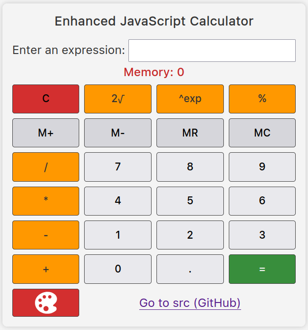
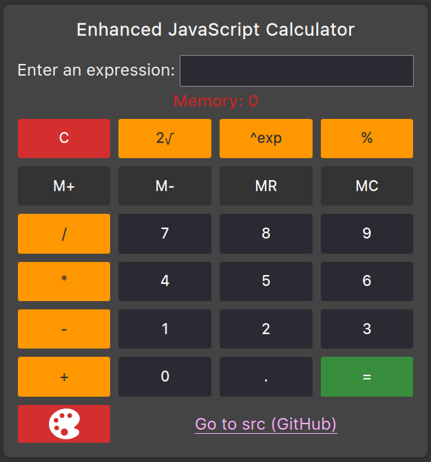

# Calculator Application

[](LICENSE)

[](https://boosty.to/theEvilGrinch/donate)
[](https://yoomoney.ru/to/410016288289737)

A professional-grade calculator application available in three distinct versions.

## Available Versions

1. **Web Version** (`main` branch) - Standard web-based calculator
2. **Progressive Web App (PWA)** (`PWA` branch) - Installable web application with offline capabilities
3. **Desktop Application** (`electron` branch) - Native desktop application built with Electron

## Table of Contents

- [Features](#features)
- [Live Demo](#live-demo)
- [Technologies Used](#technologies-used)
- [Project Structure](#project-structure)
- [Development](#development)
  - [Prerequisites](#prerequisites)
  - [Available Scripts](#available-scripts)
  - [Build and Installation](#build-and-installation)
- [License](#license)

## Features

### Core Functionality
- Basic arithmetic operations: addition (+), subtraction (-), multiplication (*), division (/)
- Advanced mathematical functions:
  - Square root (√)
  - Exponentiation (x^y)
  - Percentage calculations

### Memory Functions
- M+: Add current value to memory
- M-: Subtract from memory
- MR: Recall memory value
- MC: Clear memory
- Visual memory indicator

### User Interface
- Responsive design for all screen sizes
- Light and dark theme support
- System theme detection
- Keyboard navigation
- Visual feedback on interactions

### Progressive Web App Features
- Installable on devices
- Offline functionality
- App-like experience
- Service worker caching
- Web App Manifest

### Desktop Application Features
- Native desktop integration
- System tray support
- Global keyboard shortcuts
- Automatic updates
- Native notifications

## Live Demo

Try PWA version: [Live Demo](https://theevilgrinch.github.io/calculator-web-pwa-electron/)

**Screenshots:**

| Light Theme                                | Dark Theme                               |
|--------------------------------------------|------------------------------------------|
|  |  |

## Technologies Used

### Frontend
- HTML5 with semantic markup
- CSS3/SCSS with custom properties
- JavaScript (ES6+)

### Build Tools
- Node.js
- npm
- ESBuild
- Electron (for desktop version)
- Electron Builder

### Development Tools
- ESLint
- Stylelint
- Prettier
- Git

## Project Structure

```
calculator-web-pwa-electron/
├── assets/                             # Static assets
│   ├── color-palette.svg               # Theme toggle icon
│   └── fonts/                          # Web fonts in WOFF2 format
├── build/                              # Build artifacts and configuration files
│   ├── calculator.desktop              # Desktop entry file for Linux
│   ├── icon-{sizes}.png                # Various icon sizes for Electron
│   ├── icon.ico                        # Windows icon
│   ├── icon.icns                       # macOS icon
│   └── other electron specific files
├── src/                                # Source code for the application
│   ├── main.js                         # Main JavaScript logic for the application
│   ├── styles/                         # SCSS stylesheets for the application
│   └── index.html                      # HTML entry point for the application
├── LICENSE                             # License file
├── main.electron.js                    # Electron main process file
├── build.config.js                     # Build configuration file for the web version
├── build.js                            # Build script for the web version
├── package.json                        # Project metadata and dependencies
├── README.md                           # Project documentation
└── watch.js                            # File watcher script for development
```

## Development

### Prerequisites

- Node.js v23.4.0
- npm v11.1.0
- Development Dependencies:
  - `@stylistic/stylelint-plugin`: v3.1.2
  - `concurrently`: v9.1.2
  - `del`: v8.0.0
  - `electron`: v31.0.0
  - `electron-builder`: v26.0.12
  - `electronmon`: v2.0.3
  - `esbuild`: v0.25.0
  - `eslint`: v9.22.0
  - `fs-extra`: v11.3.0
  - `globals`: v16.0.0
  - `html-minifier-terser`: v7.2.0
  - `png2icons`: v2.0.1
  - `postcss-scss`: v4.0.9
  - `sass`: v1.85.1
  - `sharp`: v0.34.1
  - `stylelint`: v16.16.0

### Available Scripts

- `build`: Builds the project using `build.js`.
- `build:electron`: Builds the Electron application for the current operating system.
- `build:electron-cross-platform`: Builds the Electron application for Windows, macOS, and Linux.
- `icons`: Generates icons for macOS, Windows, and Linux platforms using `generate-icons.js`.
- `start:electron`: Starts the application with live reload using `electronmon`.
- `watch`: Watches for changes in the source files.
- `clean:build`: Cleans the build directory except essential files.
- `clean:dist`: Cleans the `dist/` directory.
- `clean:local_cache`: Removes the local Electron cache.
- `stylelint:fix`: Fixes SCSS styling issues.
- `eslint:fix`: Fixes JavaScript issues.

### Build and Installation

To build and install the application, follow these steps based on your operating system:

#### 1. Clone the Repository
First, clone the repository to your local machine:
```bash
git clone https://github.com/theEvilGrinch/calculator-web-pwa-electron.git
cd calculator-web-pwa-electron
```

#### 2. Install Dependencies
Before building, ensure all dependencies are installed:
```bash
npm install
```

> **Note**: Additional system dependencies may be required for building the application on specific platforms:
> - On **Linux**:
>   - `gtk3` for graphical components.
>   - `libxcrypt-compat` for building `.deb` packages.
> - On **Linux** (for cross-platform builds targeting Windows):
>   - `wine` is required to build `.exe` files for Windows.

#### 3. Build the Application
- **Single-Platform Build**: To build the application for the operating system you are currently using, run:
  ```bash
  npm run build:electron
  ```
  This will generate a platform-specific build (e.g., an `.exe` for Windows, a `.zip` for macOS, or a `.deb` for Linux) in the `build/` directory.

- **Cross-Platform Build**: To create builds for all supported platforms (Windows, macOS, and Linux), run:
  ```bash
  npm run build:electron-cross-platform
  ```
  This will produce the following files in the `build/` directory:
  - **Windows**: `calculator Setup <version>.exe` (installer).
  - **macOS**: `calculator-<version>-mac.zip` (archive).
  - **Linux**:
    - `.deb` package for Debian-based distributions.
    - `.AppImage` for universal Linux usage.

#### 4. Install the Application
After building, follow the instructions below to install the application depending on your operating system:

**Linux (`AppImage` or `.deb`)**
1. **For `.AppImage`**:
   - Copy the following files from the `build/` directory:
     - `calculator.desktop` to `~/.local/share/applications/` (or any other directory where your system stores application shortcuts).
     - `icon-256x256.png` to your preferred location for icons.
     - `calculator-<version>.AppImage` to your desired application directory.
   - Edit the `calculator.desktop` file and replace the placeholders:
     - Replace `<PATH_TO_ICON>` with the full path to the copied `icon-256x256.png`.
     - Replace `<PATH_TO_APPIMAGE>` with the full path to `calculator-<version>.AppImage`.
   - Refresh your desktop environment to register the new application.
   - Make the `.AppImage` file executable:
     ```bash
     chmod +x calculator-<version>.AppImage
     ```
   - Run the file to launch the application:
     ```bash
     ./calculator-<version>.AppImage
     ```
2. **For `.deb`**:
   ```bash
   sudo dpkg -i calculator-<version>.deb
   ```

**Windows (`.exe`)** <br>
Double-click the `.exe` installer in the `build/` directory and follow the on-screen instructions to complete the installation.

**macOS (`.zip`)**<br>
Extract the `.zip` file and move the application to your `Applications` folder.

**Note:** Replace `<version>` with the actual version number of the generated files.

## Contributing

Contributions are welcome! Please feel free to submit a Pull Request. For major changes, please open an issue first to discuss what you would like to change.

## License

MIT Licensed - See [LICENSE](LICENSE) for details.

---

⚡ Maintained by [@theEvilGrinch](https://github.com/theEvilGrinch).
